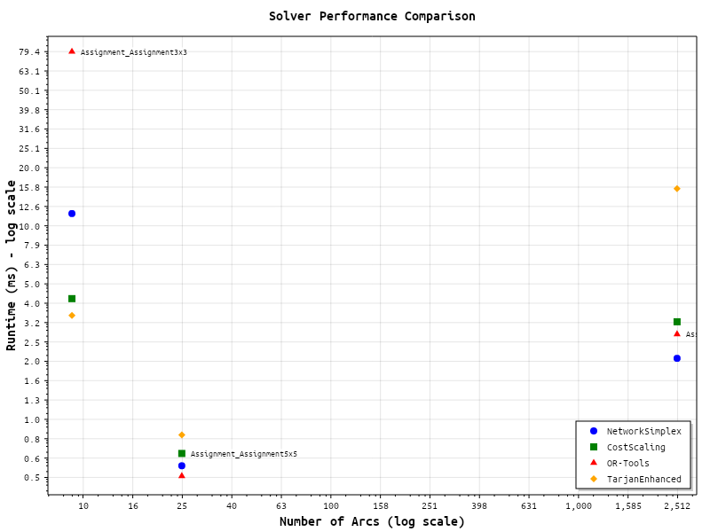

# Performance Comparison Report
Generated: 2025-06-26 06:40:05 UTC

## Summary Table

| Category | Problem | Nodes | Arcs | NetworkSimplex (ms) | CostScaling (ms) | OR-Tools (ms) | TarjanEnhanced (ms) | Winner | Best vs Worst |
|----------|---------|------:|-----:|--------------------:|-----------------:|--------------:|--------------------:|--------|---------------|
| **Assignment** | | | | | | | | | |
| Assignment | Assignment_Assignment3x3 | 6 | 9 | 11.57 | 4.20 | 79.37 | 3.45 | TarjanEnhanced | 23.04× |
| Assignment | Assignment_Assignment50x50 | 100 | 2,500 | 2.07 | 3.19 | 2.76 | 15.56 | NetworkSimplex | 7.53× |
| Assignment | Assignment_Assignment5x5 | 10 | 25 | 0.58 | 0.67 | 0.51 | 0.83 | OR-Tools | 1.63× |

## Summary Statistics
- Total problems tested: 3
- Problems solved by all four algorithms: 3

### Success Rates:
- NetworkSimplex: 3/3 (100.0%)
- CostScaling: 3/3 (100.0%)
- OR-Tools: 3/3 (100.0%)
- TarjanEnhanced: 3/3 (100.0%)

### Performance Winners (when all four solve optimally):
- NetworkSimplex wins: 1/3 (33.3%)
- CostScaling wins: 0/3 (0.0%)
- OR-Tools wins: 1/3 (33.3%)
- TarjanEnhanced wins: 1/3 (33.3%)

## Validation Summary
- Total problems with solutions: 3
- Validations passed: 12
- Validations failed: 0
- Solution files without optimal cost: 0

## Detailed Results by Category

### Assignment Problems

#### Assignment_Assignment3x3
- Nodes: 6
- Arcs: 9
- Worst-case runtime: 79.37 ms

| Solver | Status | Time (ms) | Memory (KB) | Cost |
|--------|--------|-----------|-------------|------|
| OrTools | Optimal | 79.37 (79.37-79.37) | 16 | 5 |
| CostScaling | Optimal | 4.20 (4.20-4.20) | 12 | 5 |
| NetworkSimplex | Optimal | 11.57 (11.57-11.57) | 12 | 5 |
| TarjanEnhanced | Optimal | 3.45 (3.45-3.45) | 12 | 5 |

#### Assignment_Assignment50x50
- Nodes: 100
- Arcs: 2,500
- Worst-case runtime: 15.56 ms

| Solver | Status | Time (ms) | Memory (KB) | Cost |
|--------|--------|-----------|-------------|------|
| OrTools | Optimal | 2.76 (2.76-2.76) | 717 | 50 |
| CostScaling | Optimal | 3.19 (3.19-3.19) | 493 | 50 |
| NetworkSimplex | Optimal | 2.07 (2.07-2.07) | 150 | 50 |
| TarjanEnhanced | Optimal | 15.56 (15.56-15.56) | 153 | 50 |

#### Assignment_Assignment5x5
- Nodes: 10
- Arcs: 25
- Worst-case runtime: 0.83 ms

| Solver | Status | Time (ms) | Memory (KB) | Cost |
|--------|--------|-----------|-------------|------|
| OrTools | Optimal | 0.51 (0.51-0.51) | 20 | 10 |
| CostScaling | Optimal | 0.67 (0.67-0.67) | 20 | 10 |
| NetworkSimplex | Optimal | 0.58 (0.58-0.58) | 20 | 10 |
| TarjanEnhanced | Optimal | 0.83 (0.83-0.83) | 12 | 10 |

## Performance Scatter Plot

*Note: The scatter plot shows runtime (ms) vs number of arcs for each solver on logarithmic scales.*
*NetworkSimplex (blue circles), CostScaling (green squares), OR-Tools (red triangles), TarjanEnhanced (orange diamonds)*

### Notable Data Points

| Problem | Arcs | NS (ms) | CS (ms) | OR (ms) | TE (ms) | Fastest |
|---------|-----:|--------:|--------:|--------:|--------:|---------|
| Assignment_Assignment50x50 | 2,500 | 2.07 | 3.19 | 2.76 | 15.56 | NS |
| Assignment_Assignment5x5 | 25 | 0.58 | 0.67 | 0.51 | 0.83 | OR |
| Assignment_Assignment3x3 | 9 | 11.57 | 4.20 | 79.37 | 3.45 | TE |

