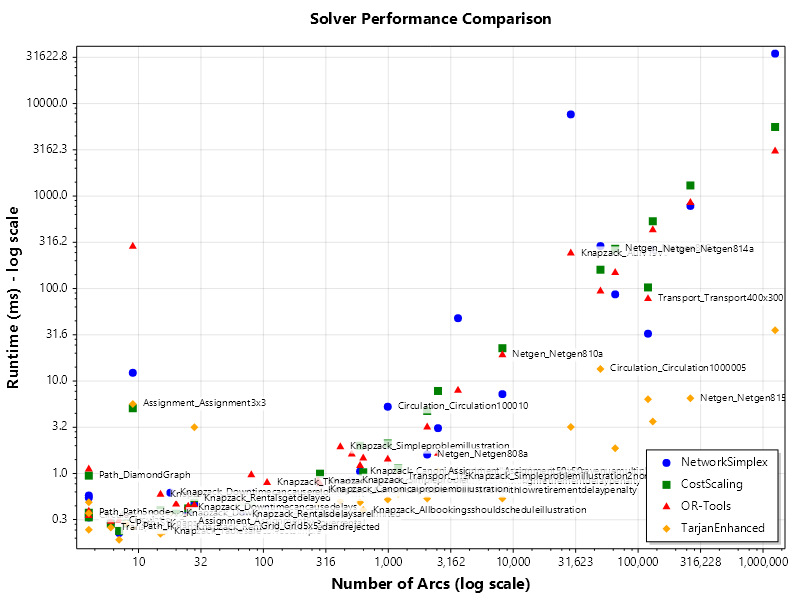

# Performance Comparison Report
Generated: 2025-06-27 00:12:52 UTC

## Summary Table

| Category | Problem | Nodes | Arcs | NetworkSimplex (ms) | CostScaling (ms) | OR-Tools (ms) | TarjanEnhanced (ms) | Winner | Best vs Worst |
|----------|---------|------:|-----:|--------------------:|-----------------:|--------------:|--------------------:|--------|---------------|
| **Assignment** | | | | | | | | | |
| Assignment | Assignment_Assignment3x3 | 6 | 9 | 12.28 | 5.08 | 285.36 | 5.66 | CostScaling | 56.17× |
| Assignment | Assignment_Assignment50x50 | 100 | 2,500 | 3.09 | 7.81 | 1.65 | 1.05 | TarjanEnhanced | 7.41× |
| Assignment | Assignment_Assignment5x5 | 10 | 25 | 0.38 | 0.42 | 0.44 | 0.30 | TarjanEnhanced | 1.45× |
| **Circulation** | | | | | | | | | |
| Circulation | Circulation_Circulation5000005 | 5,000 | 1,249,750 | 34695.57 | 5582.59 | 3055.69 | 35.44 | TarjanEnhanced | 978.92× |
| Circulation | Circulation_Circulation1000005 | 1,000 | 49,950 | 287.90 | 159.83 | 93.53 | 13.52 | TarjanEnhanced | 21.30× |
| Circulation | Circulation_Circulation100010 | 100 | 990 | 5.28 | 2.11 | 1.43 | 0.52 | TarjanEnhanced | 10.09× |
| Circulation | Circulation_Grid2x2 | 4 | 4 | 0.33 | 0.34 | 0.35 | 0.25 | TarjanEnhanced | 1.42× |
| Circulation | Circulation_CycleShortcut | 6 | 7 | 0.23 | 0.24 | 0.31 | 0.19 | TarjanEnhanced | 1.63× |
| **Grid** | | | | | | | | | |
| Grid | Grid_Grid5x5 | 25 | 80 | 0.63 | 0.50 | 0.97 | 0.27 | TarjanEnhanced | 3.59× |
| **Knapzack** | | | | | | | | | |
| Knapzack | Knapzack_Aurv19v6 | 4,531 | 28,910 | 7636.48 | INFEASIBLE | 241.81 | 3.19 | NetworkSimplex | N/A |
| Knapzack | Knapzack_Simpleproblemillustration2nonsparse | 987 | 3,614 | 47.78 | INFEASIBLE | 7.92 | 0.93 | NetworkSimplex | N/A |
| Knapzack | Knapzack_Rentalsgetdelayed | 18 | 28 | 0.47 | 0.54 | 0.46 | 3.16 | OR-Tools | 6.93× |
| Knapzack | Knapzack_Canonicalproblemillustrationwithhighrevenuemultiplier | 188 | 594 | 1.05 | 2.00 | 1.22 | 0.49 | TarjanEnhanced | 4.08× |
| Knapzack | Knapzack_Simpleproblemillustration | 157 | 413 | 0.76 | INFEASIBLE | 1.94 | 0.50 | NetworkSimplex | N/A |
| Knapzack | Knapzack_Simpleproblemillustration2 | 185 | 510 | 0.84 | INFEASIBLE | 1.62 | 0.59 | NetworkSimplex | N/A |
| Knapzack | Knapzack_Allbookingsshouldscheduleillustration | 209 | 630 | 0.71 | 1.03 | 1.47 | 0.40 | TarjanEnhanced | 3.64× |
| Knapzack | Knapzack_Canonicalproblembillustration | 109 | 284 | 0.70 | 1.00 | 0.77 | 0.67 | TarjanEnhanced | 1.49× |
| Knapzack | Knapzack_Canonicalproblemillustrationwithhighretirementdelaypenalty | 104 | 274 | 0.56 | INFEASIBLE | 0.83 | 0.48 | NetworkSimplex | N/A |
| Knapzack | Knapzack_Tablesarecorrect | 56 | 107 | 0.40 | 0.58 | 0.80 | 0.28 | TarjanEnhanced | 2.89× |
| Knapzack | Knapzack_Canonicalproblemillustrationwithlowretirementdelaypenalty | 104 | 274 | 0.65 | INFEASIBLE | 0.66 | 0.34 | NetworkSimplex | N/A |
| Knapzack | Knapzack_Downtimecancauserelocation | 13 | 18 | 0.62 | 0.35 | 0.32 | 0.35 | OR-Tools | 1.96× |
| Knapzack | Knapzack_Downtimecancauselateretirement | 10 | 15 | 0.39 | 0.40 | 0.59 | 0.36 | TarjanEnhanced | 1.64× |
| Knapzack | Knapzack_Rentalsdelaysarelimited | 35 | 67 | 0.37 | 0.50 | 0.51 | 0.33 | TarjanEnhanced | 1.56× |
| Knapzack | Knapzack_Downtimemixedacceptreject | 14 | 20 | 0.31 | 0.37 | 0.47 | 0.31 | TarjanEnhanced | 1.52× |
| Knapzack | Knapzack_Downtimecancausedelays | 17 | 25 | 0.42 | 0.29 | 0.43 | 0.25 | TarjanEnhanced | 1.70× |
| Knapzack | Knapzack_Rentalsgetacceptedandrejected | 16 | 24 | 0.26 | 0.33 | 0.34 | 0.24 | TarjanEnhanced | 1.41× |
| Knapzack | Knapzack_Downtimegetsrejected | 12 | 15 | 0.26 | 0.32 | 0.31 | 0.24 | TarjanEnhanced | 1.34× |
| Knapzack | Knapzack_Tablesarecorrectsimple | 13 | 16 | 0.29 | 0.25 | 0.32 | 0.24 | TarjanEnhanced | 1.35× |
| Knapzack | Knapzack_Downtimegetsacceptedoverrental | 12 | 15 | 0.24 | 0.29 | 0.31 | 0.22 | TarjanEnhanced | 1.40× |
| **Netgen** | | | | | | | | | |
| Netgen | Netgen_Netgen815a | 32,768 | 262,144 | 782.17 | 1302.49 | 850.30 | 6.54 | TarjanEnhanced | 199.30× |
| Netgen | Netgen_Netgen814a | 16,384 | 131,072 | 263.43 | 533.99 | 430.55 | 3.66 | TarjanEnhanced | 146.00× |
| Netgen | Netgen_Netgen813a | 8,192 | 65,536 | 86.54 | 269.12 | 148.70 | 1.87 | TarjanEnhanced | 143.79× |
| Netgen | Netgen_Netgen810a | 1,024 | 8,192 | 7.22 | 22.65 | 19.17 | 0.54 | TarjanEnhanced | 42.15× |
| Netgen | Netgen_Netgen808a | 256 | 2,048 | 1.60 | 4.75 | 3.17 | 0.54 | TarjanEnhanced | 8.82× |
| **Path** | | | | | | | | | |
| Path | Path_DiamondGraph | 4 | 4 | 0.58 | 0.95 | 1.11 | 0.49 | TarjanEnhanced | 2.28× |
| Path | Path_Path5node | 5 | 4 | 0.55 | 0.38 | 0.39 | 0.37 | TarjanEnhanced | 1.48× |
| Path | Path_StarGraph | 5 | 8 | 0.29 | 0.29 | 0.35 | 0.29 | TarjanEnhanced | 1.23× |
| Path | Path_Path10node | 10 | 9 | 0.33 | 0.33 | 0.30 | 0.27 | TarjanEnhanced | 1.25× |
| **Transport** | | | | | | | | | |
| Transport | Transport_Transport400x300 | 700 | 120,000 | 32.50 | 102.80 | 77.55 | 6.34 | TarjanEnhanced | 16.22× |
| Transport | Transport_Transport40x30 | 70 | 1,200 | 0.87 | 1.13 | 0.93 | 0.60 | TarjanEnhanced | 1.89× |
| Transport | Transport_Transport2x3 | 5 | 6 | 0.29 | 0.29 | 0.30 | 0.26 | TarjanEnhanced | 1.16× |

## Summary Statistics
- Total problems tested: 41
- Problems solved by all four algorithms: 35

### Success Rates:
- NetworkSimplex: 41/41 (100.0%)
- CostScaling: 35/41 (85.4%)
- OR-Tools: 41/41 (100.0%)
- TarjanEnhanced: 41/41 (100.0%)

### Performance Winners (when all four solve optimally):
- NetworkSimplex wins: 0/35 (0.0%)
- CostScaling wins: 1/35 (2.9%)
- OR-Tools wins: 2/35 (5.7%)
- TarjanEnhanced wins: 32/35 (91.4%)

## Validation Summary
- Total problems with solutions: 38
- Validations passed: 108
- Validations failed: 38
- Solution files without optimal cost: 0

### Failed Validations:
- **Assignment_Assignment3x3**:
  - TarjanEnhanced: Expected 5, Got 0
- **Assignment_Assignment50x50**:
  - TarjanEnhanced: Expected 50, Got 0
- **Assignment_Assignment5x5**:
  - TarjanEnhanced: Expected 10, Got 0
- **Circulation_Circulation1000005**:
  - TarjanEnhanced: Expected -21,815,005, Got 0
- **Circulation_Circulation100010**:
  - TarjanEnhanced: Expected -352,582, Got 0
- **Circulation_Circulation5000005**:
  - TarjanEnhanced: Expected -571,982,353, Got 0
- **Circulation_CycleShortcut**:
  - TarjanEnhanced: Expected 50, Got 0
- **Circulation_Grid2x2**:
  - TarjanEnhanced: Expected 75, Got 0
- **Grid_Grid5x5**:
  - TarjanEnhanced: Expected 27,000, Got 0
- **Knapzack_Allbookingsshouldscheduleillustration**:
  - TarjanEnhanced: Expected -3,912,043, Got 0
- **Knapzack_Aurv19v6**:
  - TarjanEnhanced: Expected -61,593,077,684, Got 0
- **Knapzack_Canonicalproblembillustration**:
  - TarjanEnhanced: Expected -1,700,509, Got 0
- **Knapzack_Canonicalproblemillustrationwithhighretirementdelaypenalty**:
  - TarjanEnhanced: Expected -1,649,138, Got 0
- **Knapzack_Canonicalproblemillustrationwithhighrevenuemultiplier**:
  - TarjanEnhanced: Expected -5,243,116, Got 0
- **Knapzack_Canonicalproblemillustrationwithlowretirementdelaypenalty**:
  - TarjanEnhanced: Expected -1,649,138, Got 0
- **Knapzack_Downtimecancausedelays**:
  - TarjanEnhanced: Expected -1,620,362, Got 0
- **Knapzack_Downtimecancauselateretirement**:
  - TarjanEnhanced: Expected -1,018,600, Got 0
- **Knapzack_Downtimecancauserelocation**:
  - TarjanEnhanced: Expected -657,264, Got 0
- **Knapzack_Downtimegetsacceptedoverrental**:
  - TarjanEnhanced: Expected -1,101,400, Got 0
- **Knapzack_Downtimegetsrejected**:
  - TarjanEnhanced: Expected -1,093,934, Got 0
- **Knapzack_Downtimemixedacceptreject**:
  - TarjanEnhanced: Expected -1,200,835, Got 0
- **Knapzack_Rentalsdelaysarelimited**:
  - TarjanEnhanced: Expected -798,361, Got 0
- **Knapzack_Rentalsgetacceptedandrejected**:
  - TarjanEnhanced: Expected -229,925, Got 0
- **Knapzack_Rentalsgetdelayed**:
  - TarjanEnhanced: Expected -174,542, Got 0
- **Knapzack_Simpleproblemillustration**:
  - TarjanEnhanced: Expected -2,445,000, Got 0
- **Knapzack_Simpleproblemillustration2**:
  - TarjanEnhanced: Expected -2,951,332, Got 0
- **Knapzack_Simpleproblemillustration2nonsparse**:
  - TarjanEnhanced: Expected -2,954,928, Got 0
- **Knapzack_Tablesarecorrect**:
  - TarjanEnhanced: Expected -574,807, Got 0
- **Knapzack_Tablesarecorrectsimple**:
  - TarjanEnhanced: Expected -300, Got 0
- **Netgen_Netgen808a**:
  - TarjanEnhanced: Expected 142,274,536, Got 0
- **Netgen_Netgen813a**:
  - TarjanEnhanced: Expected 1,184,953,451, Got 0
- **Path_DiamondGraph**:
  - TarjanEnhanced: Expected 80, Got 0
- **Path_Path10node**:
  - TarjanEnhanced: Expected 900, Got 0
- **Path_Path5node**:
  - TarjanEnhanced: Expected 100, Got 0
- **Path_StarGraph**:
  - TarjanEnhanced: Expected 90, Got 0
- **Transport_Transport2x3**:
  - TarjanEnhanced: Expected 85, Got 0
- **Transport_Transport400x300**:
  - TarjanEnhanced: Expected 445,090, Got 0
- **Transport_Transport40x30**:
  - TarjanEnhanced: Expected 42,667, Got 0

## Detailed Results by Category

### Assignment Problems

#### Assignment_Assignment3x3
- Nodes: 6
- Arcs: 9
- Worst-case runtime: 285.36 ms

| Solver | Status | Time (ms) | Memory (KB) | Cost |
|--------|--------|-----------|-------------|------|
| OrTools | Optimal | 285.36 (285.36-285.36) | 16 | 5 |
| CostScaling | Optimal | 5.08 (5.08-5.08) | 12 | 5 |
| NetworkSimplex | Optimal | 12.28 (12.28-12.28) | 12 | 5 |
| TarjanEnhanced | Optimal | 5.66 (5.66-5.66) | 12 | 0 |

#### Assignment_Assignment50x50
- Nodes: 100
- Arcs: 2,500
- Worst-case runtime: 7.81 ms

| Solver | Status | Time (ms) | Memory (KB) | Cost |
|--------|--------|-----------|-------------|------|
| OrTools | Optimal | 1.65 (1.65-1.65) | 717 | 50 |
| CostScaling | Optimal | 7.81 (7.81-7.81) | 493 | 50 |
| NetworkSimplex | Optimal | 3.09 (3.09-3.09) | 150 | 50 |
| TarjanEnhanced | Optimal | 1.05 (1.05-1.05) | 196 | 0 |

#### Assignment_Assignment5x5
- Nodes: 10
- Arcs: 25
- Worst-case runtime: 0.44 ms

| Solver | Status | Time (ms) | Memory (KB) | Cost |
|--------|--------|-----------|-------------|------|
| OrTools | Optimal | 0.44 (0.44-0.44) | 12 | 10 |
| CostScaling | Optimal | 0.42 (0.42-0.42) | 12 | 10 |
| NetworkSimplex | Optimal | 0.38 (0.38-0.38) | 12 | 10 |
| TarjanEnhanced | Optimal | 0.30 (0.30-0.30) | 4 | 0 |

### Circulation Problems

#### Circulation_Circulation5000005
- Nodes: 5,000
- Arcs: 1,249,750
- Worst-case runtime: 34695.57 ms

| Solver | Status | Time (ms) | Memory (KB) | Cost |
|--------|--------|-----------|-------------|------|
| OrTools | Optimal | 3055.69 (3055.69-3055.69) | 242089 | -571,982,353 |
| CostScaling | Optimal | 5582.59 (5582.59-5582.59) | 220097 | -571,982,353 |
| NetworkSimplex | Optimal | 34695.57 (34695.57-34695.57) | 60445 | -571,982,353 |
| TarjanEnhanced | Optimal | 35.44 (35.44-35.44) | 88085 | 0 |

#### Circulation_Circulation1000005
- Nodes: 1,000
- Arcs: 49,950
- Worst-case runtime: 287.90 ms

| Solver | Status | Time (ms) | Memory (KB) | Cost |
|--------|--------|-----------|-------------|------|
| OrTools | Optimal | 93.53 (93.53-93.53) | 13083 | -21,815,005 |
| CostScaling | Optimal | 159.83 (159.83-159.83) | 9318 | -21,815,005 |
| NetworkSimplex | Optimal | 287.90 (287.90-287.90) | 2535 | -21,815,005 |
| TarjanEnhanced | Optimal | 13.52 (13.52-13.52) | 3560 | 0 |

#### Circulation_Circulation100010
- Nodes: 100
- Arcs: 990
- Worst-case runtime: 5.28 ms

| Solver | Status | Time (ms) | Memory (KB) | Cost |
|--------|--------|-----------|-------------|------|
| OrTools | Optimal | 1.43 (1.43-1.43) | 342 | -352,582 |
| CostScaling | Optimal | 2.11 (2.11-2.11) | 210 | -352,582 |
| NetworkSimplex | Optimal | 5.28 (5.28-5.28) | 78 | -352,582 |
| TarjanEnhanced | Optimal | 0.52 (0.52-0.52) | 87 | 0 |

#### Circulation_Grid2x2
- Nodes: 4
- Arcs: 4
- Worst-case runtime: 0.35 ms

| Solver | Status | Time (ms) | Memory (KB) | Cost |
|--------|--------|-----------|-------------|------|
| OrTools | Optimal | 0.35 (0.35-0.35) | 8 | 75 |
| CostScaling | Optimal | 0.34 (0.34-0.34) | 8 | 75 |
| NetworkSimplex | Optimal | 0.33 (0.33-0.33) | 16 | 75 |
| TarjanEnhanced | Optimal | 0.25 (0.25-0.25) | 8 | 0 |

#### Circulation_CycleShortcut
- Nodes: 6
- Arcs: 7
- Worst-case runtime: 0.31 ms

| Solver | Status | Time (ms) | Memory (KB) | Cost |
|--------|--------|-----------|-------------|------|
| OrTools | Optimal | 0.31 (0.31-0.31) | 8 | 50 |
| CostScaling | Optimal | 0.24 (0.24-0.24) | 8 | 50 |
| NetworkSimplex | Optimal | 0.23 (0.23-0.23) | 8 | 50 |
| TarjanEnhanced | Optimal | 0.19 (0.19-0.19) | 8 | 0 |

### Grid Problems

#### Grid_Grid5x5
- Nodes: 25
- Arcs: 80
- Worst-case runtime: 0.97 ms

| Solver | Status | Time (ms) | Memory (KB) | Cost |
|--------|--------|-----------|-------------|------|
| OrTools | Optimal | 0.97 (0.97-0.97) | 28 | 27,000 |
| CostScaling | Optimal | 0.50 (0.50-0.50) | 27 | 27,000 |
| NetworkSimplex | Optimal | 0.63 (0.63-0.63) | 20 | 27,000 |
| TarjanEnhanced | Optimal | 0.27 (0.27-0.27) | 19 | 0 |

### Knapzack Problems

#### Knapzack_Aurv19v6
- Nodes: 4,531
- Arcs: 28,910
- Worst-case runtime: 7636.48 ms

| Solver | Status | Time (ms) | Memory (KB) | Cost |
|--------|--------|-----------|-------------|------|
| OrTools | Optimal | 241.81 (241.81-241.81) | 6314 | -61,593,077,684 |
| NetworkSimplex | Optimal | 7636.48 (7636.48-7636.48) | 2220 | -61,593,077,684 |
| TarjanEnhanced | Optimal | 3.19 (3.19-3.19) | 2227 | 0 |

#### Knapzack_Simpleproblemillustration2nonsparse
- Nodes: 987
- Arcs: 3,614
- Worst-case runtime: 47.78 ms

| Solver | Status | Time (ms) | Memory (KB) | Cost |
|--------|--------|-----------|-------------|------|
| OrTools | Optimal | 7.92 (7.92-7.92) | 703 | -2,954,928 |
| NetworkSimplex | Optimal | 47.78 (47.78-47.78) | 348 | -2,954,928 |
| TarjanEnhanced | Optimal | 0.93 (0.93-0.93) | 307 | 0 |

#### Knapzack_Rentalsgetdelayed
- Nodes: 18
- Arcs: 28
- Worst-case runtime: 3.16 ms

| Solver | Status | Time (ms) | Memory (KB) | Cost |
|--------|--------|-----------|-------------|------|
| OrTools | Optimal | 0.46 (0.46-0.46) | 8 | -174,542 |
| CostScaling | Optimal | 0.54 (0.54-0.54) | 16 | -174,542 |
| NetworkSimplex | Optimal | 0.47 (0.47-0.47) | 16 | -174,542 |
| TarjanEnhanced | Optimal | 3.16 (3.16-3.16) | 16 | 0 |

#### Knapzack_Canonicalproblemillustrationwithhighrevenuemultiplier
- Nodes: 188
- Arcs: 594
- Worst-case runtime: 2.00 ms

| Solver | Status | Time (ms) | Memory (KB) | Cost |
|--------|--------|-----------|-------------|------|
| OrTools | Optimal | 1.22 (1.22-1.22) | 170 | -5,243,116 |
| CostScaling | Optimal | 2.00 (2.00-2.00) | 146 | -5,243,116 |
| NetworkSimplex | Optimal | 1.05 (1.05-1.05) | 64 | -5,243,116 |
| TarjanEnhanced | Optimal | 0.49 (0.49-0.49) | 61 | 0 |

#### Knapzack_Simpleproblemillustration
- Nodes: 157
- Arcs: 413
- Worst-case runtime: 1.94 ms

| Solver | Status | Time (ms) | Memory (KB) | Cost |
|--------|--------|-----------|-------------|------|
| OrTools | Optimal | 1.94 (1.94-1.94) | 86 | -2,445,000 |
| NetworkSimplex | Optimal | 0.76 (0.76-0.76) | 53 | -2,445,000 |
| TarjanEnhanced | Optimal | 0.50 (0.50-0.50) | 48 | 0 |

#### Knapzack_Simpleproblemillustration2
- Nodes: 185
- Arcs: 510
- Worst-case runtime: 1.62 ms

| Solver | Status | Time (ms) | Memory (KB) | Cost |
|--------|--------|-----------|-------------|------|
| OrTools | Optimal | 1.62 (1.62-1.62) | 171 | -2,951,332 |
| NetworkSimplex | Optimal | 0.84 (0.84-0.84) | 64 | -2,951,332 |
| TarjanEnhanced | Optimal | 0.59 (0.59-0.59) | 55 | 0 |

#### Knapzack_Allbookingsshouldscheduleillustration
- Nodes: 209
- Arcs: 630
- Worst-case runtime: 1.47 ms

| Solver | Status | Time (ms) | Memory (KB) | Cost |
|--------|--------|-----------|-------------|------|
| OrTools | Optimal | 1.47 (1.47-1.47) | 168 | -3,912,043 |
| CostScaling | Optimal | 1.03 (1.03-1.03) | 152 | -3,912,043 |
| NetworkSimplex | Optimal | 0.71 (0.71-0.71) | 68 | -3,912,043 |
| TarjanEnhanced | Optimal | 0.40 (0.40-0.40) | 68 | 0 |

#### Knapzack_Canonicalproblembillustration
- Nodes: 109
- Arcs: 284
- Worst-case runtime: 1.00 ms

| Solver | Status | Time (ms) | Memory (KB) | Cost |
|--------|--------|-----------|-------------|------|
| OrTools | Optimal | 0.77 (0.77-0.77) | 82 | -1,700,509 |
| CostScaling | Optimal | 1.00 (1.00-1.00) | 76 | -1,700,509 |
| NetworkSimplex | Optimal | 0.70 (0.70-0.70) | 41 | -1,700,509 |
| TarjanEnhanced | Optimal | 0.67 (0.67-0.67) | 36 | 0 |

#### Knapzack_Canonicalproblemillustrationwithhighretirementdelaypenalty
- Nodes: 104
- Arcs: 274
- Worst-case runtime: 0.83 ms

| Solver | Status | Time (ms) | Memory (KB) | Cost |
|--------|--------|-----------|-------------|------|
| OrTools | Optimal | 0.83 (0.83-0.83) | 82 | -1,649,138 |
| NetworkSimplex | Optimal | 0.56 (0.56-0.56) | 40 | -1,649,138 |
| TarjanEnhanced | Optimal | 0.48 (0.48-0.48) | 40 | 0 |

#### Knapzack_Tablesarecorrect
- Nodes: 56
- Arcs: 107
- Worst-case runtime: 0.80 ms

| Solver | Status | Time (ms) | Memory (KB) | Cost |
|--------|--------|-----------|-------------|------|
| OrTools | Optimal | 0.80 (0.80-0.80) | 48 | -574,807 |
| CostScaling | Optimal | 0.58 (0.58-0.58) | 39 | -574,807 |
| NetworkSimplex | Optimal | 0.40 (0.40-0.40) | 24 | -574,807 |
| TarjanEnhanced | Optimal | 0.28 (0.28-0.28) | 24 | 0 |

#### Knapzack_Canonicalproblemillustrationwithlowretirementdelaypenalty
- Nodes: 104
- Arcs: 274
- Worst-case runtime: 0.66 ms

| Solver | Status | Time (ms) | Memory (KB) | Cost |
|--------|--------|-----------|-------------|------|
| OrTools | Optimal | 0.66 (0.66-0.66) | 82 | -1,649,138 |
| NetworkSimplex | Optimal | 0.65 (0.65-0.65) | 36 | -1,649,138 |
| TarjanEnhanced | Optimal | 0.34 (0.34-0.34) | 40 | 0 |

#### Knapzack_Downtimecancauserelocation
- Nodes: 13
- Arcs: 18
- Worst-case runtime: 0.62 ms

| Solver | Status | Time (ms) | Memory (KB) | Cost |
|--------|--------|-----------|-------------|------|
| OrTools | Optimal | 0.32 (0.32-0.32) | 20 | -657,264 |
| CostScaling | Optimal | 0.35 (0.35-0.35) | 20 | -657,264 |
| NetworkSimplex | Optimal | 0.62 (0.62-0.62) | 20 | -657,264 |
| TarjanEnhanced | Optimal | 0.35 (0.35-0.35) | 12 | 0 |

#### Knapzack_Downtimecancauselateretirement
- Nodes: 10
- Arcs: 15
- Worst-case runtime: 0.59 ms

| Solver | Status | Time (ms) | Memory (KB) | Cost |
|--------|--------|-----------|-------------|------|
| OrTools | Optimal | 0.59 (0.59-0.59) | 12 | -1,018,600 |
| CostScaling | Optimal | 0.40 (0.40-0.40) | 20 | -1,018,600 |
| NetworkSimplex | Optimal | 0.39 (0.39-0.39) | 12 | -1,018,600 |
| TarjanEnhanced | Optimal | 0.36 (0.36-0.36) | 12 | 0 |

#### Knapzack_Rentalsdelaysarelimited
- Nodes: 35
- Arcs: 67
- Worst-case runtime: 0.51 ms

| Solver | Status | Time (ms) | Memory (KB) | Cost |
|--------|--------|-----------|-------------|------|
| OrTools | Optimal | 0.51 (0.51-0.51) | 24 | -798,361 |
| CostScaling | Optimal | 0.50 (0.50-0.50) | 32 | -798,361 |
| NetworkSimplex | Optimal | 0.37 (0.37-0.37) | 24 | -798,361 |
| TarjanEnhanced | Optimal | 0.33 (0.33-0.33) | 16 | 0 |

#### Knapzack_Downtimemixedacceptreject
- Nodes: 14
- Arcs: 20
- Worst-case runtime: 0.47 ms

| Solver | Status | Time (ms) | Memory (KB) | Cost |
|--------|--------|-----------|-------------|------|
| OrTools | Optimal | 0.47 (0.47-0.47) | 20 | -1,200,835 |
| CostScaling | Optimal | 0.37 (0.37-0.37) | 20 | -1,200,835 |
| NetworkSimplex | Optimal | 0.31 (0.31-0.31) | 20 | -1,200,835 |
| TarjanEnhanced | Optimal | 0.31 (0.31-0.31) | 12 | 0 |

#### Knapzack_Downtimecancausedelays
- Nodes: 17
- Arcs: 25
- Worst-case runtime: 0.43 ms

| Solver | Status | Time (ms) | Memory (KB) | Cost |
|--------|--------|-----------|-------------|------|
| OrTools | Optimal | 0.43 (0.43-0.43) | 20 | -1,620,362 |
| CostScaling | Optimal | 0.29 (0.29-0.29) | 20 | -1,620,362 |
| NetworkSimplex | Optimal | 0.42 (0.42-0.42) | 16 | -1,620,362 |
| TarjanEnhanced | Optimal | 0.25 (0.25-0.25) | 16 | 0 |

#### Knapzack_Rentalsgetacceptedandrejected
- Nodes: 16
- Arcs: 24
- Worst-case runtime: 0.34 ms

| Solver | Status | Time (ms) | Memory (KB) | Cost |
|--------|--------|-----------|-------------|------|
| OrTools | Optimal | 0.34 (0.34-0.34) | 20 | -229,925 |
| CostScaling | Optimal | 0.33 (0.33-0.33) | 20 | -229,925 |
| NetworkSimplex | Optimal | 0.26 (0.26-0.26) | 20 | -229,925 |
| TarjanEnhanced | Optimal | 0.24 (0.24-0.24) | 12 | 0 |

#### Knapzack_Downtimegetsrejected
- Nodes: 12
- Arcs: 15
- Worst-case runtime: 0.32 ms

| Solver | Status | Time (ms) | Memory (KB) | Cost |
|--------|--------|-----------|-------------|------|
| OrTools | Optimal | 0.31 (0.31-0.31) | 12 | -1,093,934 |
| CostScaling | Optimal | 0.32 (0.32-0.32) | 20 | -1,093,934 |
| NetworkSimplex | Optimal | 0.26 (0.26-0.26) | 20 | -1,093,934 |
| TarjanEnhanced | Optimal | 0.24 (0.24-0.24) | 12 | 0 |

#### Knapzack_Tablesarecorrectsimple
- Nodes: 13
- Arcs: 16
- Worst-case runtime: 0.32 ms

| Solver | Status | Time (ms) | Memory (KB) | Cost |
|--------|--------|-----------|-------------|------|
| OrTools | Optimal | 0.32 (0.32-0.32) | 12 | -300 |
| CostScaling | Optimal | 0.25 (0.25-0.25) | 20 | -300 |
| NetworkSimplex | Optimal | 0.29 (0.29-0.29) | 20 | -300 |
| TarjanEnhanced | Optimal | 0.24 (0.24-0.24) | 12 | 0 |

#### Knapzack_Downtimegetsacceptedoverrental
- Nodes: 12
- Arcs: 15
- Worst-case runtime: 0.31 ms

| Solver | Status | Time (ms) | Memory (KB) | Cost |
|--------|--------|-----------|-------------|------|
| OrTools | Optimal | 0.31 (0.31-0.31) | 12 | -1,101,400 |
| CostScaling | Optimal | 0.29 (0.29-0.29) | 20 | -1,101,400 |
| NetworkSimplex | Optimal | 0.24 (0.24-0.24) | 20 | -1,101,400 |
| TarjanEnhanced | Optimal | 0.22 (0.22-0.22) | 12 | 0 |

### Netgen Problems

#### Netgen_Netgen815a
- Nodes: 32,768
- Arcs: 262,144
- Worst-case runtime: 1302.49 ms

| Solver | Status | Time (ms) | Memory (KB) | Cost |
|--------|--------|-----------|-------------|------|
| OrTools | Optimal | 850.30 (850.30-850.30) | 56316 | 2,704,236,434 |
| CostScaling | Optimal | 1302.49 (1302.49-1302.49) | 50452 | 2,704,236,434 |
| NetworkSimplex | Optimal | 782.17 (782.17-782.17) | 16625 | 2,704,236,434 |
| TarjanEnhanced | Optimal | 6.54 (6.54-6.54) | 19728 | 0 |

#### Netgen_Netgen814a
- Nodes: 16,384
- Arcs: 131,072
- Worst-case runtime: 533.99 ms

| Solver | Status | Time (ms) | Memory (KB) | Cost |
|--------|--------|-----------|-------------|------|
| OrTools | Optimal | 430.55 (430.55-430.55) | 27161 | 1,772,056,888 |
| CostScaling | Optimal | 533.99 (533.99-533.99) | 26502 | 1,772,056,888 |
| NetworkSimplex | Optimal | 263.43 (263.43-263.43) | 8321 | 1,772,056,888 |
| TarjanEnhanced | Optimal | 3.66 (3.66-3.66) | 9865 | 0 |

#### Netgen_Netgen813a
- Nodes: 8,192
- Arcs: 65,536
- Worst-case runtime: 269.12 ms

| Solver | Status | Time (ms) | Memory (KB) | Cost |
|--------|--------|-----------|-------------|------|
| OrTools | Optimal | 148.70 (148.70-148.70) | 13096 | 1,184,953,451 |
| CostScaling | Optimal | 269.12 (269.12-269.12) | 13266 | 1,184,953,451 |
| NetworkSimplex | Optimal | 86.54 (86.54-86.54) | 4170 | 1,184,953,451 |
| TarjanEnhanced | Optimal | 1.87 (1.87-1.87) | 4945 | 0 |

#### Netgen_Netgen810a
- Nodes: 1,024
- Arcs: 8,192
- Worst-case runtime: 22.65 ms

| Solver | Status | Time (ms) | Memory (KB) | Cost |
|--------|--------|-----------|-------------|------|
| OrTools | Optimal | 19.17 (19.17-19.17) | 1468 | 369,269,289 |
| CostScaling | Optimal | 22.65 (22.65-22.65) | 1676 | 369,269,289 |
| NetworkSimplex | Optimal | 7.22 (7.22-7.22) | 531 | 369,269,289 |
| TarjanEnhanced | Optimal | 0.54 (0.54-0.54) | 633 | 0 |

#### Netgen_Netgen808a
- Nodes: 256
- Arcs: 2,048
- Worst-case runtime: 4.75 ms

| Solver | Status | Time (ms) | Memory (KB) | Cost |
|--------|--------|-----------|-------------|------|
| OrTools | Optimal | 3.17 (3.17-3.17) | 705 | 142,274,536 |
| CostScaling | Optimal | 4.75 (4.75-4.75) | 427 | 142,274,536 |
| NetworkSimplex | Optimal | 1.60 (1.60-1.60) | 140 | 142,274,536 |
| TarjanEnhanced | Optimal | 0.54 (0.54-0.54) | 169 | 0 |

### Path Problems

#### Path_DiamondGraph
- Nodes: 4
- Arcs: 4
- Worst-case runtime: 1.11 ms

| Solver | Status | Time (ms) | Memory (KB) | Cost |
|--------|--------|-----------|-------------|------|
| OrTools | Optimal | 1.11 (1.11-1.11) | 12 | 80 |
| CostScaling | Optimal | 0.95 (0.95-0.95) | 12 | 80 |
| NetworkSimplex | Optimal | 0.58 (0.58-0.58) | 12 | 80 |
| TarjanEnhanced | Optimal | 0.49 (0.49-0.49) | 12 | 0 |

#### Path_Path5node
- Nodes: 5
- Arcs: 4
- Worst-case runtime: 0.55 ms

| Solver | Status | Time (ms) | Memory (KB) | Cost |
|--------|--------|-----------|-------------|------|
| OrTools | Optimal | 0.39 (0.39-0.39) | 12 | 100 |
| CostScaling | Optimal | 0.38 (0.38-0.38) | 12 | 100 |
| NetworkSimplex | Optimal | 0.55 (0.55-0.55) | 12 | 100 |
| TarjanEnhanced | Optimal | 0.37 (0.37-0.37) | 12 | 0 |

#### Path_StarGraph
- Nodes: 5
- Arcs: 8
- Worst-case runtime: 0.35 ms

| Solver | Status | Time (ms) | Memory (KB) | Cost |
|--------|--------|-----------|-------------|------|
| OrTools | Optimal | 0.35 (0.35-0.35) | 20 | 90 |
| CostScaling | Optimal | 0.29 (0.29-0.29) | 12 | 90 |
| NetworkSimplex | Optimal | 0.29 (0.29-0.29) | 12 | 90 |
| TarjanEnhanced | Optimal | 0.29 (0.29-0.29) | 4 | 0 |

#### Path_Path10node
- Nodes: 10
- Arcs: 9
- Worst-case runtime: 0.33 ms

| Solver | Status | Time (ms) | Memory (KB) | Cost |
|--------|--------|-----------|-------------|------|
| OrTools | Optimal | 0.30 (0.30-0.30) | 12 | 900 |
| CostScaling | Optimal | 0.33 (0.33-0.33) | 12 | 900 |
| NetworkSimplex | Optimal | 0.33 (0.33-0.33) | 12 | 900 |
| TarjanEnhanced | Optimal | 0.27 (0.27-0.27) | 4 | 0 |

### Transport Problems

#### Transport_Transport400x300
- Nodes: 700
- Arcs: 120,000
- Worst-case runtime: 102.80 ms

| Solver | Status | Time (ms) | Memory (KB) | Cost |
|--------|--------|-----------|-------------|------|
| OrTools | Optimal | 77.55 (77.55-77.55) | 27198 | 445,090 |
| CostScaling | Optimal | 102.80 (102.80-102.80) | 22504 | 445,090 |
| NetworkSimplex | Optimal | 32.50 (32.50-32.50) | 5845 | 445,090 |
| TarjanEnhanced | Optimal | 6.34 (6.34-6.34) | 8476 | 0 |

#### Transport_Transport40x30
- Nodes: 70
- Arcs: 1,200
- Worst-case runtime: 1.13 ms

| Solver | Status | Time (ms) | Memory (KB) | Cost |
|--------|--------|-----------|-------------|------|
| OrTools | Optimal | 0.93 (0.93-0.93) | 349 | 42,667 |
| CostScaling | Optimal | 1.13 (1.13-1.13) | 251 | 42,667 |
| NetworkSimplex | Optimal | 0.87 (0.87-0.87) | 76 | 42,667 |
| TarjanEnhanced | Optimal | 0.60 (0.60-0.60) | 104 | 0 |

#### Transport_Transport2x3
- Nodes: 5
- Arcs: 6
- Worst-case runtime: 0.30 ms

| Solver | Status | Time (ms) | Memory (KB) | Cost |
|--------|--------|-----------|-------------|------|
| OrTools | Optimal | 0.30 (0.30-0.30) | 12 | 85 |
| CostScaling | Optimal | 0.29 (0.29-0.29) | 4 | 85 |
| NetworkSimplex | Optimal | 0.29 (0.29-0.29) | 12 | 85 |
| TarjanEnhanced | Optimal | 0.26 (0.26-0.26) | 4 | 0 |

## Performance Scatter Plot

*Note: The scatter plot shows runtime (ms) vs number of arcs for each solver on logarithmic scales.*
*NetworkSimplex (blue circles), CostScaling (green squares), OR-Tools (red triangles), TarjanEnhanced (orange diamonds)*

### Notable Data Points

| Problem | Arcs | NS (ms) | CS (ms) | OR (ms) | TE (ms) | Fastest |
|---------|-----:|--------:|--------:|--------:|--------:|---------|
| Circulation_Circulation5000005 | 1,249,750 | 34695.57 | 5582.59 | 3055.69 | 35.44 | TE |
| Netgen_Netgen815a | 262,144 | 782.17 | 1302.49 | 850.30 | 6.54 | TE |
| Netgen_Netgen814a | 131,072 | 263.43 | 533.99 | 430.55 | 3.66 | TE |
| Transport_Transport400x300 | 120,000 | 32.50 | 102.80 | 77.55 | 6.34 | TE |
| Netgen_Netgen813a | 65,536 | 86.54 | 269.12 | 148.70 | 1.87 | TE |

